# check-check

## : Boomlabs EVM 트랙 팀6 프로젝트

## 프로젝트 R&R

| 팀원            | 파트           | 멘토     |
| --------------- | -------------- | -------- |
| mozy - 개발     | 서버 DB, API   | 박진형님 |
| easyzero - 개발 | 프론트 봇      | MAZY님   |
| Jerry H. - 개발 | 스마트컨트렉트 | 채린님   |
| foozim - 기획   | 기획, PM       |          |

오프라인 모임을 통해 많은 설계 이슈들을 정리했으나, 그후에도 많은 난관이 있었음…

## A. 프로젝트 아이디어

- 블록체인을 활용한 **출석체크 서비스**
- 프로젝트 이름: `Check-Check!!`
  - 부제.. “호텔 캘리포니아~ you can check-out anytime you want but you can never leave”
  - → 블록체인에 체크인 기록이 저장된다!
- 기능: 출석 체크 유틸리티 + 수료 조건에 부합한 학생 대상 수료증 발급

- 누가 쓰나?
  - **(1) 붐랩스 스터디의 (참석자) 출석체크**
    - EVM수업 총 8회 중 6회 출석 시 _자동_ POAP (수료증) 발행 조건
  - **(2) web3 프로젝트의 디스코드 채널 마케팅 용 출석체크**
    - No more “m, gn, gm, gn….” 채널 메시지
    - 마케팅 이벤트 참여로 NFT 민팅 기능
- 기대 효과
  - DAO 및 커뮤니티의 web3 **출석체크 유틸리티 기능**으로 사용
  - 게임적 요소를 통한 커뮤니티 지속
  - 소셜 기능으로 확장으로 커뮤니티 강화
  - 블록체인의 특징을 활용한 POAP 발행

## B. 아이디어 탄생 및 선정 배경

- 문제점
  - 대부분의 web3 프로젝트에서 커뮤니티는 매우 중요. 사용자 모집 등.. 그래서 다들 디스코드를 만든다
  - 그리고, 커뮤니티의 engagement 및 친밀도를 높이기 위해서 #gm 채널 등을 유지하는데 (개인적인 생각으로) 정말 쓸때없는 data traffic을 유발하고.. 사용자 입장에서 필요 이상의 update alert가 뜬다
- 솔루션
  - 그래서, #gm 채널 대신 #check-check 기능을 제공해서 ‘출석체크' 기능으로 제공
  - 붐랩스 수업 출석 체크인 → 수료증 발급까지 _조건부 자동화_ 구현

예시 1 - 수많은 gm.. gn… gm.. 무한 반복

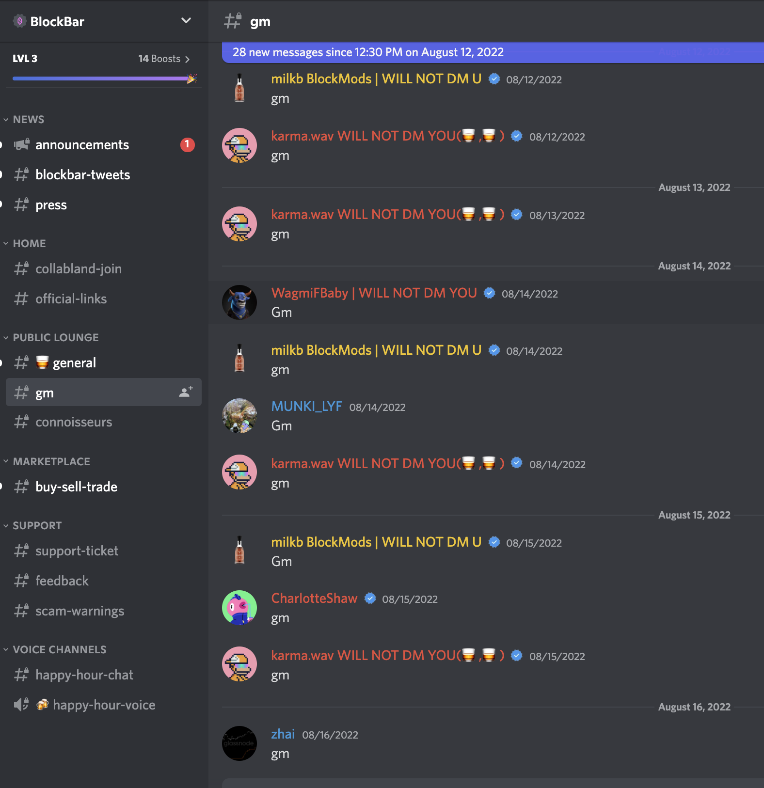

- 추가 예시 들 (출서: 디스코드 채널들)
  예시 2 여기도
  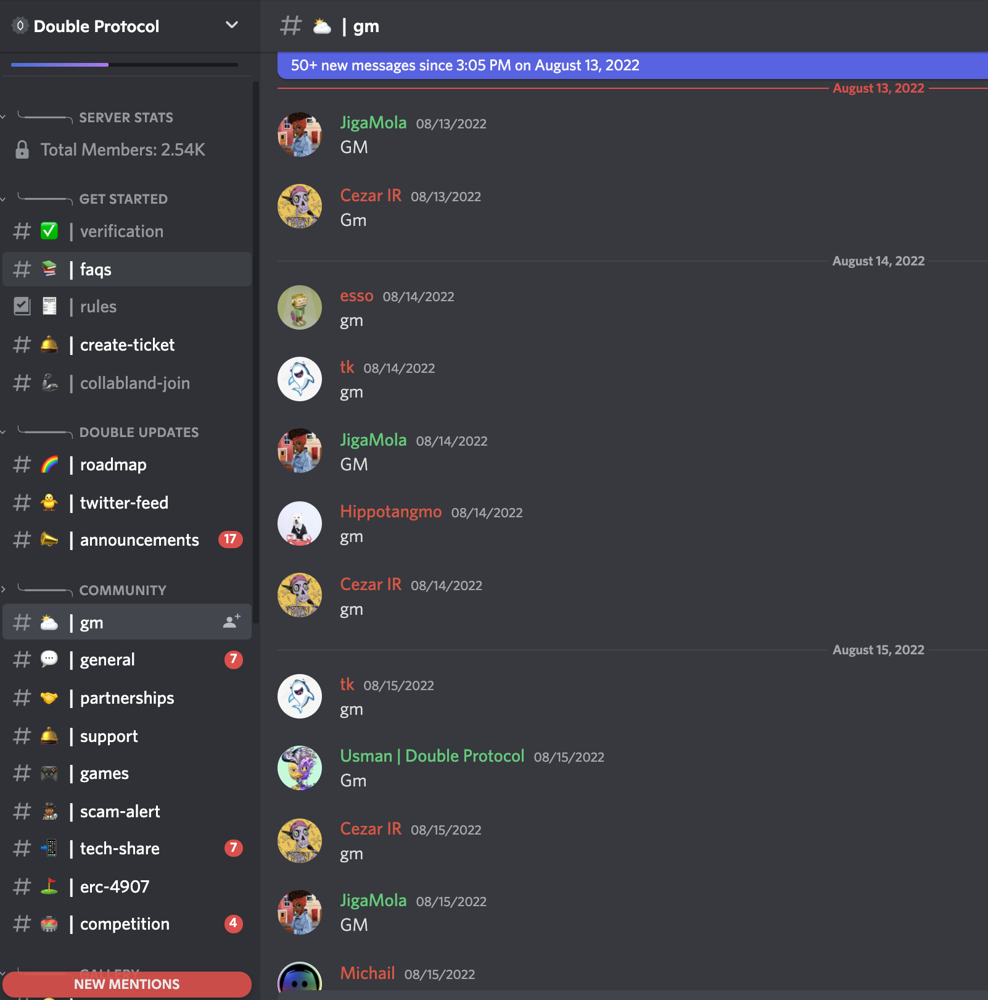
  예시 3 - 여기도 !!
  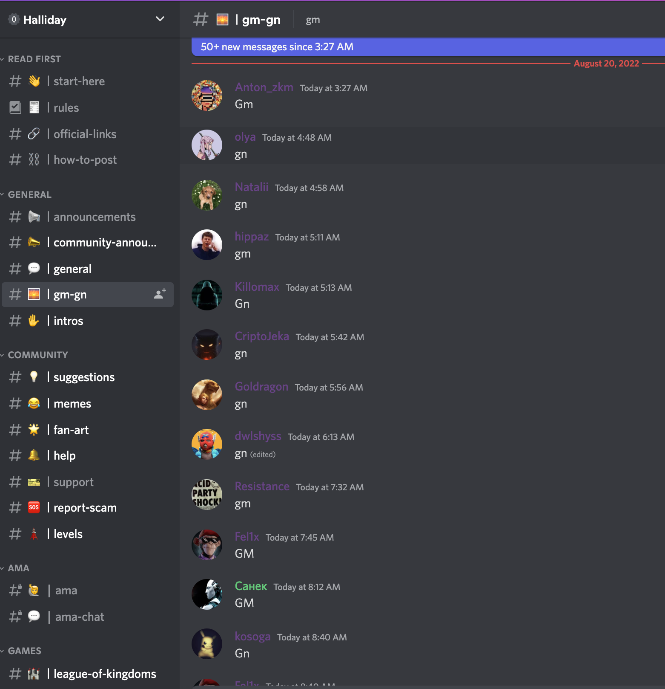
  예시 4 - 여기도 !
  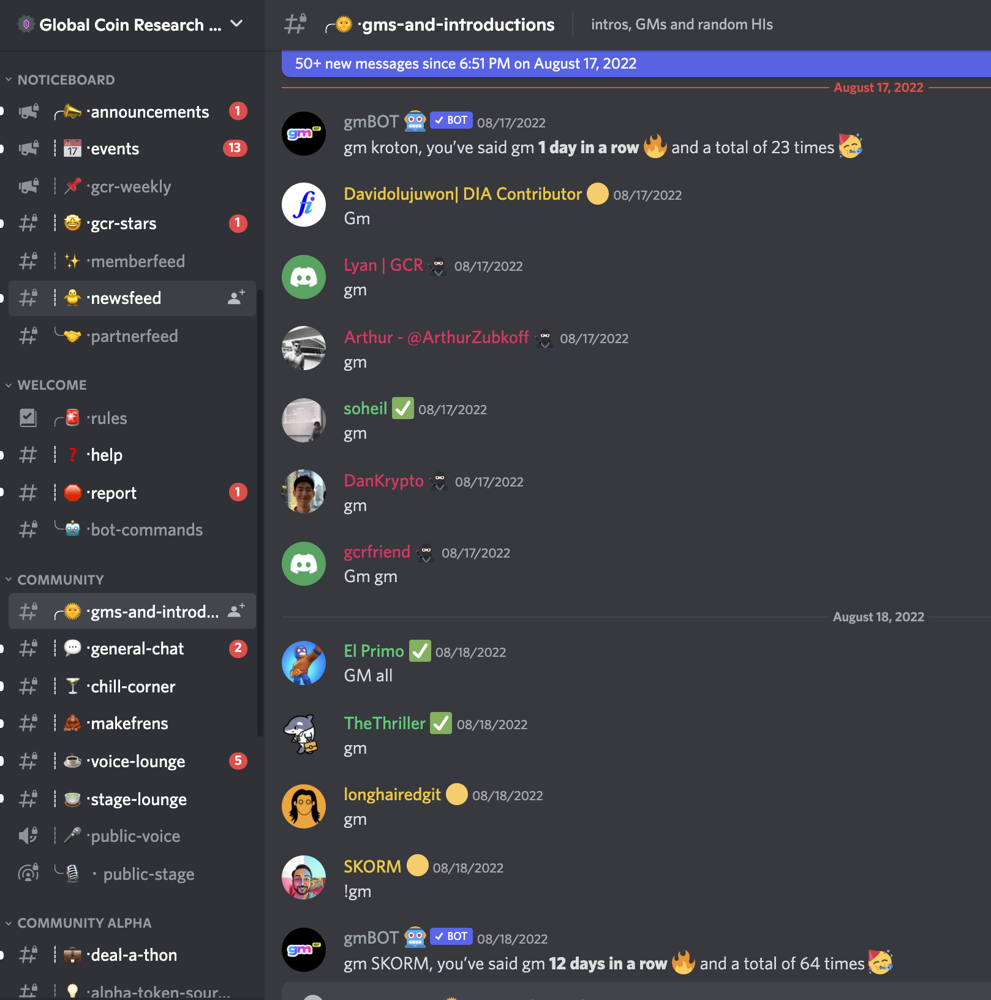
  예시 5 - 끝도없이 많은 채널에서 … 이런 상황
  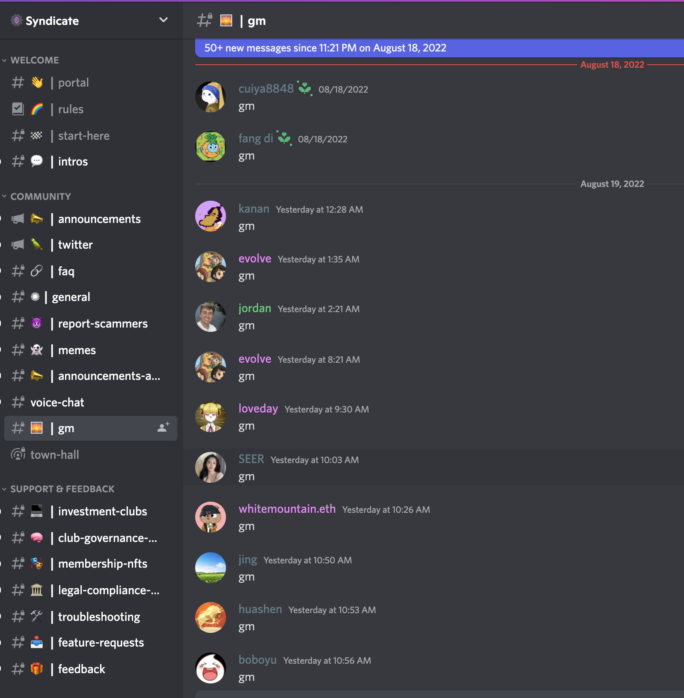

## C. 페이지 구성 & 기능 구성

### **학생 (사용자/참여자) 페이지**

- 체크인 + POAP 받을 지갑주소 제출
- “나의 출석 체크인 히스토리” 보기
  - e.g. 내가 수업 몇번 출석했더라? - 수료증 받을 수 있을까? 확인

### **어드민 (주최측/운영자) 페이지**

- 체크인 이벤트 생성
  - 디스코드 서버에 채널 생성
    - e.g. #EVM_class_1
    - e.g. #DUNE_class1
  - 체크인 가능 시간 (time window) 설정 (예, 오전 10 - 1시 사이)
- 체크인 히스토리 리뷰
  - ㅇ월 ㅇ일 수업 출석체크 완료 리스트 및 통계 (20명 중 15명, 75% 출석률 이네..)
  - 참석자의 지갑주소, 체크인 시간 등등 확인 (확장시)
- POAP (수료증) 발급 (수료증 이미지 등 업로드 정보 입력 화면)

## D. Workflow Final

약 3번의 iteration을 거침

- 1차 웹 프론트 버전 (old)
  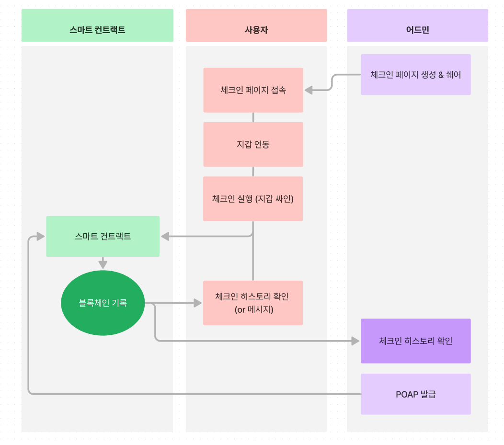
- 2차 디스코드 봇 버전 (2차)
  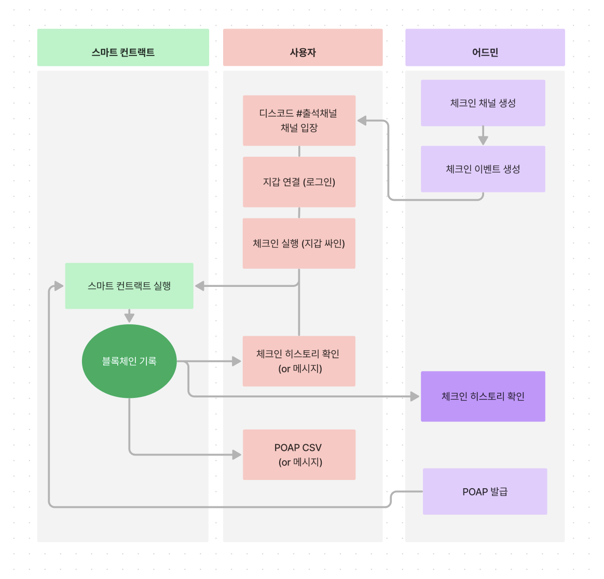
- 3차 Final
  

## E. DEMO 프리뷰

1. 디스코드 봇 **커맨드 리스트**

   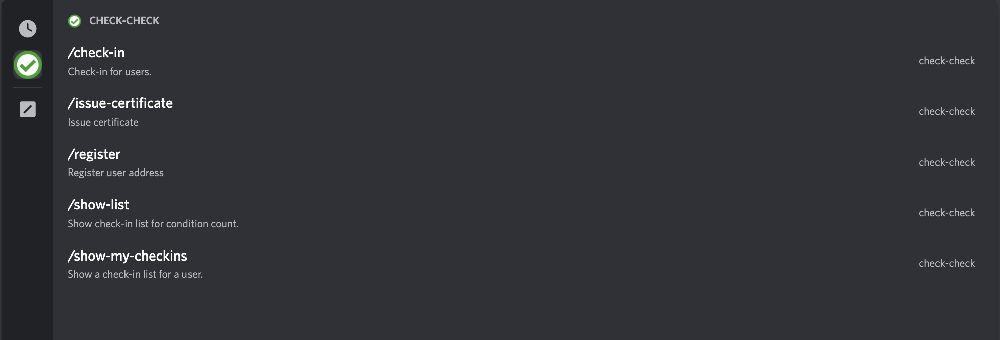

2. 주소 등록

   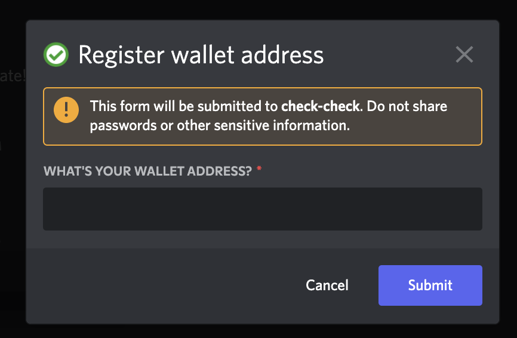

3. 체크인 하기

   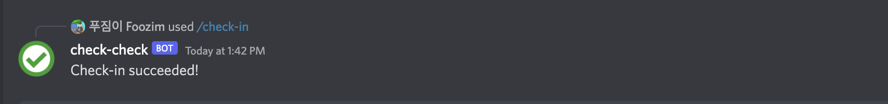

4. 나의 체크인 기록 확인

   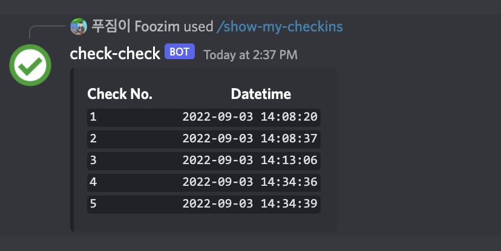

5. 어드민 화면: /show-list

   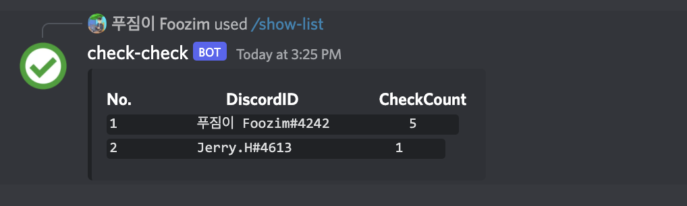

6. 어드민 화면: /issue-certificate

   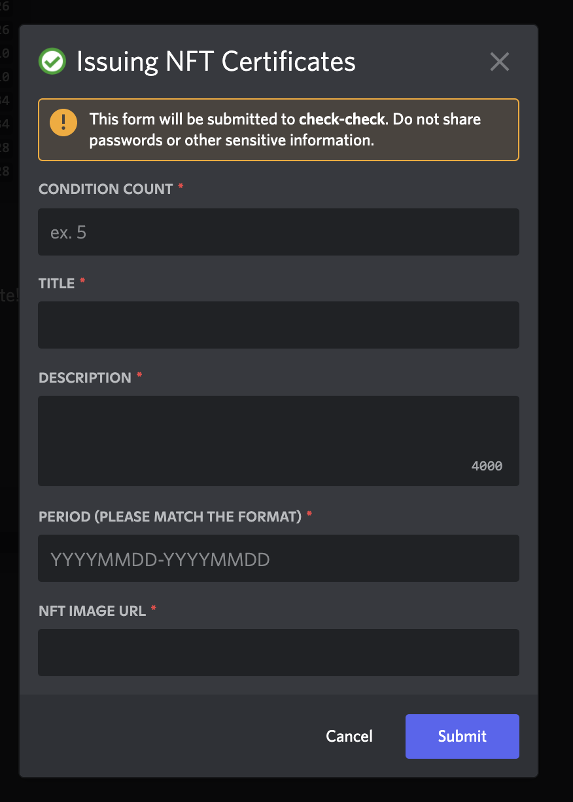

### 스마트컨트랙트 확인

[https://goerli.etherscan.io/address/0xa0813403bb3046bb40cab65a5813e7160f101c57](https://goerli.etherscan.io/address/0xa0813403bb3046bb40cab65a5813e7160f101c57)

## F. 설계 관련 주요 정보

---

## 👍 1. NFT metadata - NFT에 들어가야 할 정보

어드민이 NFT에 입력할 값 `/issue-certificate`

- 수업 Title = EVM 배우기
- 수업 Description = Solidity를 활용한 EVM 교육
- 수업 기간 = 2022/7/18 ~ 2022/9/3
- 수료증 이미지 (URL) = pinata URL등 주소 (모든 학생 동일한 이미지(”스티커”))
- [https://gateway.pinata.cloud/ipfs/QmQ3bhG3gBmgB8cYbxgYPwmoBdcR5vNED5HJCcy9kfQd9k](https://gateway.pinata.cloud/ipfs/QmQ3bhG3gBmgB8cYbxgYPwmoBdcR5vNED5HJCcy9kfQd9k)

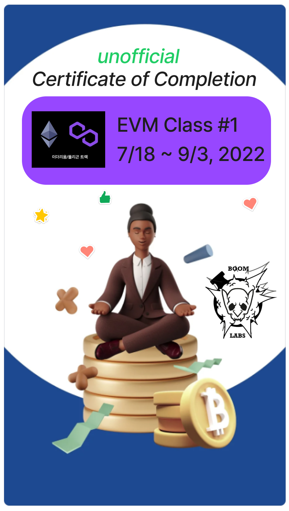

## 👍 2. 디스코드 커맨드 리스트

| 권한                        | 디스코드 커맨드    | 설명                                                                                                                      | input / data               | output / data                                           | Required |
| --------------------------- | ------------------ | ------------------------------------------------------------------------------------------------------------------------- | -------------------------- | ------------------------------------------------------- | -------- |
| Student                     | /check-in          | ✅ 출석 기록                                                                                                              | 디스코드아이디, timestamp  |                                                         |          |
|                             | /register          | ✅ 지갑 주소 등록                                                                                                         | - 디스코드아이디, 지갑주소 |
| - 채널 키값 (채널에서 pull) |                    |                                                                                                                           |
|                             | /show-my-checkins  | ☑️ 오늘까지 체크인 한 기록 리스트                                                                                         | 디스코드아이디, timestamp  |                                                         |          |
| Admin                       | /show-list         | ✅ 현재 까지의 출석부 리스트 출력 (확인 용)                                                                               |                            | 아이디, 지갑주소, 출석횟수, 수료증부여결과충족여부(y/n) |          |
|                             | /issue-certificate | ✅ 수료증 NFT 발행 = 클래스 종료 + 사전 정의 된 조건에 충족하는 주소를 다 모아서, 스마트컨트렉트로 multi-call 호출에 전송 | • 수업 Title = EVM 배우기  |

• 수업 Description = Solidity를 활용한 EVM 교육
• 수업 기간 = 2022/7 ~ 2022/8
• 수료증 이미지 (URL) = pinata URL등 주소 (모든 학생 동일한 이미지(”스티커”))
• 사용할 샘플 이미지 | | 권한 owner only |

## 👍 3. DB 테이블 정의

- Table `User`
  | USER_ID | USER_ADDRESS | DISCORD_CHANNEL_ID | DISCORD_ID |
  | -------------------- | -------------- | ----------------------------------- | --------------- |
  | 테이블 유니크 아이디 | 유저 지갑 주소 | 디스코드 채널(클래스/이벤트) 아이디 | 디스코드 아이디 |
  | 123 | 0x333333 | 1st-EVM | foozim #2323 |
  | | | | |
- Table `Check-in`
  | CHECK_IN_ID | USER_ID | DISCORD_CHANNEL_ID | CHECK_IN_DATE |
  | -------------------- | ----------- | ----------------------------------- | ------------------ |
  | 테이블 유니크 아이디 | User 아이디 | 디스코드 채널(클래스/이벤트) 아이디 | 수업 체크인 데이트 |
  | 1 | 123 | 1st-EVM | 8/1/2022 |
  | 2 | 123 | 1st-EVM | 8/7/2022 |

## 👍 4. API

[API Endpoint (1)](https://www.notion.so/f0f2c767739248c1a1e2c2d84c36f2db)

## 👍 5. Our Tech Stack

- L1 : Ethereum
- L2 : Goerli Testnet
- RPC Provider :
- Dev Env : Hardhat, Remix
- Off-chain storage : IPFS & Web3Storage
- Indexing : n/a
- Identify : Metamask 지갑 주소
- Client : Discord bot

# _Archived_

---

- 진행 과정
  [TODO ](https://www.notion.so/b06eaf7fe24c480c9a6e99491d6886bd)
- 기능 요건
  | | 기본 기능 | Advanced 기능 |
  | ------------------------------- | ------------------------------------------------------------------------------- | ----------------------------------------------------------------------------------------------- |
  | 설명 | 붐랩스 토이프로젝트 기간 만들수 있는 기능만 우선 | 더 발전시키고 싶으면 추가한다.. 시간 되면 |
  | Klaytn 헤커톤에 참여한다! |
  | 기능 1 | (프론트) |
  | 체크인 웹 페이지 or 디스코드 봇 | Check-in 2 Earn (C2E) - 우리만의 토큰 발행해서, 체크인 할때 마다 1 포인트 준다. |
  | 기능 2 | (본인 인증) |
  | 사용자 지갑 연동 or 주소 입력 | 랭킹 페이지 - 누가 누가 체크인 제일 많이했나.. 개근상 준다 |
  | 기능 3 | 체크인 스마트컨트렉트 발행 기록 | 수익 모델 - 체크인 할때 마다 수수료 받을까 - 체크인 이벤트 참여 시, 체크인포인트를 걸도록 한다. |
  | 기능 4 | 마이 체크인 히스토리 == 어드민 출석기록부 | 자체 토큰 발행. |
  | 기능 5 | 마이 POAP 발급 | |

# **Lessons Learned**

### 설계관련 잘한점

- 웹프론트 페이지 → 디스코드 봇 생성으로 결정

  - 학생이 굳이 별도 사이트 안가도 되고, 쉽게 사용할수 있도록 고려
  - 프론트+디자인 공수 줄이기
  - 디스코드 커맨드를 통해 정보 입력 및 확인

- 학생이 매번 check-in 하면, 매번 온체인에 기록을 할까?
  - Yes, 정확한 기록이지만 매번 gas비 발생 → 중간 서버에 우선 기록 하자!
  - Goerli Testnet 사용
  - POAP인데 경험에 대한 NFT이니까  **non-transferrable** 해야 함. non-transferrable 토큰 으로 발행하자 (ERC-1238)
  - 어드민이 POAP은 한번에 발급 할수 있도록!

### 설계관련 아쉬운점

- 하나의 이미지와 metadata를 참여자 여러 명에게 minting하는 것이므로 ERC-721 보다 ERC-1155로 minting하는게 더 좋았을 것
- 서버에 요청을 하면, 매 수업(=collection)마다 새로운 contract를 배포하고 그 기반으로 NFT 토큰을 발행했어야 할 것
- 디스코드에서 admin이 이미지 파일을 포함한 수업 정보를 함께 요청하면, ipfs에 이미지 + metadata를 업로드 해주고 이에 대한 tokenUri까지 return해줬으면 UX적으로 더 좋았을 것

### 추가 기능 개선점 (시간 관계상 무시한 사항들 하지만 개선 필요)

- 무지성 체크인에 대한 체크 필요 한가? 어뷰징 이슈 체크 필요
- 수업에 참석 한 자만 체크인 할수 있게 인증?
  - 체크인 코드 발행. 매 수업 전 어드민이 매번 생성 해서 부여 하고 공유
- 이 수료증을 발행한 주체에 대한 POAP 진위 여부를 확인 하기 위한 정보

### 총평 : 팀워크 / 시간 제약 / 멘토링

- 약 10일만에 파트타임으로 만들어야하는 챌린지
  - 디스코드 챗봇도 처음, 스마트컨트택트도 처음 등
  - 스마트컨트렉트에서 multicall 기능 사용. 리스트별로 컨트렉트를 동시 다발적으로 부르는것
  - QA하는 시간 부족
- 교훈: 토이 프로젝트 기간 내, 기능 설계는 확장성을 고려하되, 스코핑은 현실적으로 판단 하자!!
- 오프라인으로 작업은 꼭 필요 했었던 것 같다..
- 멘토님들과 좀 더 많은 논의가 있었으면 좋았을텐데..
- 그래도 이정도면 잘 마무리 했다!! 👏

[end]

---
